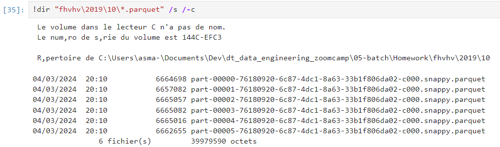

## Week 5 Homework 

In this homework we'll put what we learned about Spark in practice.

For this homework we will be using the FHV 2019-10 data found here. [FHV Data](https://github.com/DataTalksClub/nyc-tlc-data/releases/download/fhv/fhv_tripdata_2019-10.csv.gz)

### Question 1: 

**Install Spark and PySpark** 

- Install Spark
- Run PySpark
- Create a local spark session
- Execute spark.version.

What's the output?

> Output is '3.5.0'. Which makes sense as I downloaded spark 3.5.0. See [Homework.ipynb](./Homework.ipynb).

### Question 2: 

**FHV October 2019**

Read the October 2019 FHV into a Spark Dataframe with a schema as we did in the lessons.

Repartition the Dataframe to 6 partitions and save it to parquet.

What is the average size of the Parquet (ending with .parquet extension) Files that were created (in MB)? Select the answer which most closely matches.

- 6MB

> Around 6MB. See [Homework.ipynb](./Homework.ipynb).

### Question 3: 

**Count records** 

How many taxi trips were there on the 15th of October?

Consider only trips that started on the 15th of October.

- 62,610

>  See [Homework.ipynb](./Homework.ipynb).

### Question 4: 

**Longest trip for each day** 

What is the length of the longest trip in the dataset in hours?

- 631,152.50 Hours

>  See [Homework.ipynb](./Homework.ipynb).

### Question 5: 

**User Interface**

Spark’s User Interface which shows the application's dashboard runs on which local port?

- 4040

### Question 6: 

**Least frequent pickup location zone**

Load the zone lookup data into a temp view in Spark 
[Zone Data](https://github.com/DataTalksClub/nyc-tlc-data/releases/download/misc/taxi_zone_lookup.csv)

Using the zone lookup data and the FHV October 2019 data, what is the name of the LEAST frequent pickup location Zone? 

- Jamaica Bay

>  See [Homework.ipynb](./Homework.ipynb).
